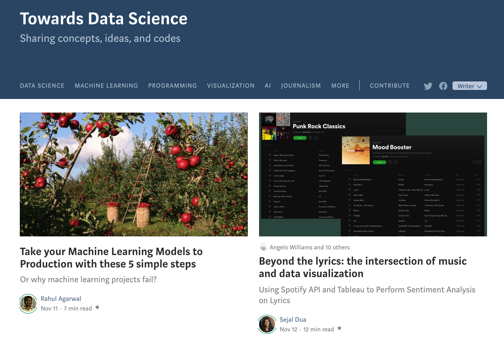

# lyrical-sentiment-analysis

## The article

I got a Medium account in July of 2019. Ever since agreeing to pay $5 a month for some excellent content from regular people like me, my life has been changed. Now when I wake up at 7:30am each day, I use the restroom, brush my teeth, hydrate with a nice glass of water, and read my Medium daily digest. These 7 articles have never failed me and always kickstart my day by either inspiring me to be productive or teaching me something totally novel that I want to try out for myself immediately after reading.

Long story short, I made it my own personal mission to one day get published on Medium. And that day has finally come, my friends! My article "Beyond the lyrics: the intersection of music and data visualization" was published in the Towards Data Science publication on Medium. https://towardsdatascience.com/beyond-the-lyrics-the-intersection-of-music-and-data-visualization-4a71039f447c.

Please check it out, and if you enjoy it, toss me some claps or a follow. It feels good that people value what I have to say. I hope this is the first of many articles for me.

## Spotify Developer Account
First, you will need to create a Spotify API project to get an API client id and client secret. To do that, head to https://developer.spotify.com/dashboard and login with your Spotify account.
Now you have to execute the following steps:
1. On the right top corner, click on “create a client ID”
2. Fill out the form, name, description and what you are building (Mobile App is a good choice)
3. Answer if you are developing a commercial integration. Answer: NO.
4. Accept the terms of service.
In just a few hours or days, you should be good to go with a client id and client secret so that you can start using spotipy to get your hands on that data!
If you already have a client id and secret, go ahead and open up the file called "public_code.ipynb" in this repo and replace all instances of "YOUR-CLIENT-ID-HERE

## Tools you will need
* `pip install spotipy`
* `pip install PyLyrics`
* `pip install wordcloud`
* `pip install nltk`

Note: I am assuming that you have some basic libraries like matplotlib, re, os, numpy, and collections

## Downloading Tableau
To download Tableau onto your Desktop (if you don't already have it), visit this site: https://www.tableau.com/products/desktop/download. If you are a student or teacher, you can get a free 1-year license (that is what I did), or you can get a free 14-day trial. They will ask for your information and what you want to use Tableau for, but it is a fairly painless process.

## Using Tableau
It's hard to document all the steps I took to produce a visualization in Tableau, so I screen captured my actions and made a GIF out of the QuickTime movie. Try to follow the GIF below

